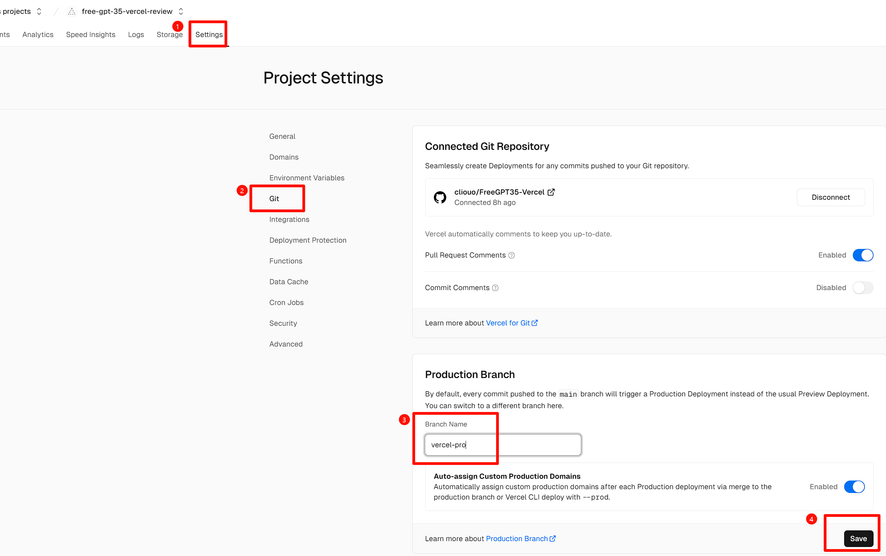
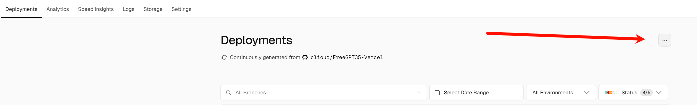
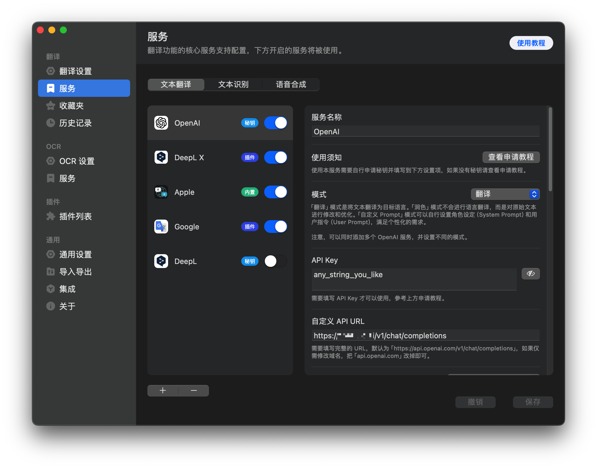

简体中文 / [English](./README_en.md)

[Vercel免费版升级为60s](https://vercel.com/changelog/vercel-functions-for-hobby-can-now-run-up-to-60-seconds)

#### 依然存在的问题
- 超过60s之后会断流。(因为Vercel免费版持续时间最大值60秒，因此使用沉浸式翻译记得降低`最大文本长度`到600左右，并发30)。
#### 解决办法:
Vercel Pro 计划 超时上限为300s，并且自带cron计划任务[跳转Pro部署介绍](#3-vercel-pro-计划的尊贵用户移除请求最大持续时间10s上限)


---------------------
## Vercel一键部署按钮 
[](https://vercel.com/new/clone?repository-url=https%3A%2F%2Fgithub.com%2Fcliouo%2FFreeGPT35-Vercel&skippable-integrations=1)

暂时不需要数据库和定时任务，可以一键部署了

--------------------

## 部署项目 数据库和定时任务暂时不需要了，后面再想吧
#### 以下均建议绑定自定义域名解决Vercel域名被阻断问题
### 方式一: fork仓库部署 [Vercel](https://vercel.com/) 
1. fork 本仓库，fork时，取消勾选 `Copy the main branch only`
2. 进入Vercel，导入您fork的仓库
3. 点击`Deploy`，等待部署完成
4. (可选) 在`Settings`的`Domains`下绑定你自己的域名。
转到顶部`Deployments`选项卡，`Redeploy`重新部署你的项目
5.  完成! 鼓掌

--------------------

### 方式二: `Vercel Pro` 计划的尊贵用户，移除请求最大持续时间10s上限，自带cron定时任务
1. 前几步部署和上述相同
2. 只需在最后`Redeploy`重新部署前，到`Settings`下的`Git`页面，在`Production Branch`填入`vercel-pro`点击`Save`

3. 然后转到顶部`Deployments`选项卡，注意不要在下面已经部署的记录里选!!!，点击如图右上角的三个点 `Create Deployment`选择`vercel-pro`然后`Create Deployment`

4. 完成! 鼓掌

--------------------

## 请求示例

**如果你没有设置`AUTH_TOKEN`，你可以不传递`Authorization`，也可以随意传递任何字符串。**

```bash
curl https://[Your Vercel Domain]/v1/chat/completions \
  -H "Content-Type: application/json" \
  -H "Authorization: Bearer any_string_you_like" \
  -d '{
    "model": "gpt-3.5-turbo",
    "messages": [
      {
        "role": "user",
        "content": "Hello!"
      }
    ],
    "stream": true
    }'
```
## 高级设置
### 环境变量 (如果你不知道是干嘛的，请不要随意设置)

| Key                       | 示例值                         | 解释                                          | 要求  |
|---------------------------|-------------------------------|-----------------------------------------------|-------|
| `AUTH_TOKEN`              | myapikey                     | 你为自己接口设置的apikey。                      | 可选  |


## 兼容性

您可以在任何客户端中使用它，如 `OpenCat`、`Next-Chat`、`Lobe-Chat`、`Bob` 等。在**API Key**中随意填写任何字符串或者你设置了`AUTH_TOKEN`，就填写它。

### Bob


## Credits
- Forked From: [https://github.com/missuo/FreeGPT35](https://github.com/missuo/FreeGPT35)
- Higher Upstream: [https://github.com/skzhengkai/free-chatgpt-api](https://github.com/skzhengkai/free-chatgpt-api)
- Original Author: [https://github.com/PawanOsman/ChatGPT](https://github.com/PawanOsman/ChatGPT)
## Similar Project

- [aurora](https://github.com/aurora-develop/aurora): Golang development, support for multiple deployment methods
## License
AGPL 3.0 License
